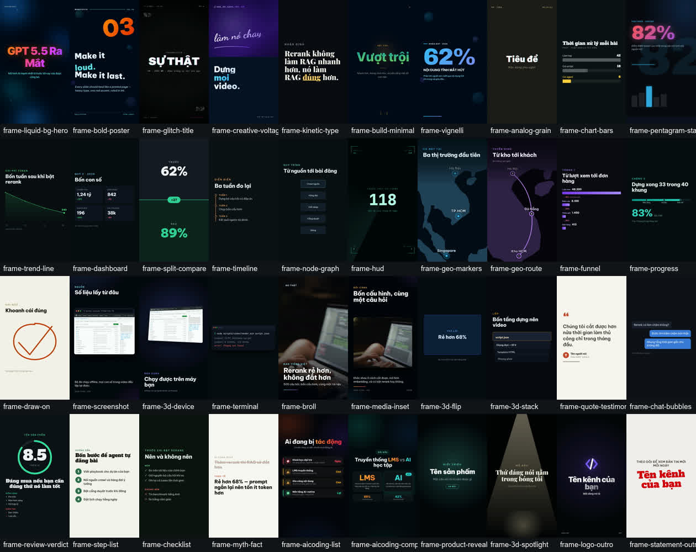

<div align="center">

# content-agent-kit

**Tell an agentic IDE what you want to publish. It reads this repo and builds the agent.**

[](https://github.com/XuHo-IT/Content-Agent-Kit/actions/workflows/ci.yml)
[](LICENSE)
[](#requirements)
[](#requirements)
[](https://github.com/XuHo-IT/Content-Agent-Kit/discussions)
[](CONTRIBUTING.md)

[Tiếng Việt](README.md) · **🌐 English**

</div>

---

A reusable kit for bootstrapping **autonomous content agents** in agentic IDEs
(**Claude Code** and **Antigravity / Gemini**). Clone it, tell the AI what you want to build,
and it reads this repo to scaffold a project-specific agent: a *playbook* (the source of
truth), state files, publish scripts, an optional crawl-discovery pipeline, social posting,
scheduling, a pre-publish review gate — and, if you want them, **9:16 videos with real
narration, stock footage and web screenshots**.

## See the output first

Before deciding whether to build an agent, look at what one produces. **One source** —
Anthropic's Claude Fable 5 announcement — became **two formats**:

| | |
|---|---|
| 📄 **[Sample article](examples/ai-news-social/sample-output/)** | 951 Vietnamese words — the body is **plain text**, meta and slug live in their own fields; plus an engagement comment and how it scores against all 10 rubric criteria |
| 🖼️ **[Cover image](examples/ai-news-social/sample-output/cover.jpg)** | 1024×1024, made for the article above |
| 🎬 **[Sample video](examples/ai-video-social/sample-output/)** | 2 min 12 s · 1080×1920 · real Vbee narration · Pexels B-roll · live screenshot of the source page |

**[▶️ Download the mp4 (15.5 MB)](https://github.com/XuHo-IT/Content-Agent-Kit/releases/tag/v0.1.0)**
· or regenerate it yourself: `node scripts/video/render.mjs examples/ai-video-social/sample-output/script.json`

There is also a **[review-genre sample](examples/ai-video-social/sample-review-rag/)** — 8 scenes,
80 seconds, every number measured from [RAG-EVAL-VN](https://github.com/XuHo-IT/RAG-EVAL-VN), with a
whole scene given to **the cost**: a review that lists only upsides is an advertisement, and
viewers can tell.

The same news story also exists as a **[white-canvas, ocean-blue cut](examples/ai-video-social/sample-output-paper-blue/)**
— 16 scenes across 14 of the 40 templates, repainted entirely by `"theme": "paper-blue"`:
**no forked template, and not one line of CSS edited in `video-templates/`.**

And a **[GEO sample](examples/ai-video-social/sample-geo/)** — two unrelated things share that
acronym, kept in one place so nobody does the wrong one: the `local` video genre, where the
story is *where*, and `geo-audit.mjs`, which grades whether a post still means anything once
an answer engine quotes one paragraph of it. Read `post-draft.md` → `geo-report.md` →
`post-fixed.md` in that order and the whole idea is there.

### Forty templates, grouped by what they do

[](video-templates/CATALOG.md)

Row 1 **hooks** and **statements** · row 2 **data** · row 3 **evidence**, **depth** and
**people** · row 4 **sequence**, **reveal** and **close**. Every tile carries its own
template id, so the picture is enough to choose from.

This used to be strips ordered by which batch each template arrived in. Someone choosing a
frame does not care about that.

`frame-broll`, `frame-media-inset`, `frame-screenshot` and `frame-3d-device` are
**footage-led** — the copy is theirs, the picture is yours. What fills them here is borrowed
from the sample video itself: the footage is one frame of the Pexels clip its scene 14 uses,
and the capture is the page `frame-screenshot`'s own `url` slot already names. Slots and
character limits are in **[`CATALOG.md`](video-templates/CATALOG.md)**.

```bash
node scripts/video/template-sheet.mjs --preset all --per-row 10 --width 126 \
  --out examples/gallery/templates.jpg
```

Ten per row and 126px are not the defaults — those are 4 and 240, which stack forty 9:16
tiles into a 4520px column you have to scroll past. Ten across keeps the picture at the
1260px width it has always been.

The same tool previews a script **without spending a single TTS character**:

```bash
node scripts/video/template-sheet.mjs --script brain/<slug>/script.json --out frames.jpg
```

Not sure which frames a given kind of video needs?
**[`docs/21-video-genres.md`](docs/21-video-genres.md)** and **[`VIDEO_GENRES.template.json`](templates/VIDEO_GENRES.template.json)** have sequences for
seven: review, tutorial, news, listicle, launch, testimonial and **`local`** — the one where
the story is *where*.

## The operating model

```
                       ┌──────────── PLAYBOOK.md (single source of truth) ───────────┐
                       │  cadence · schemas · quality bar · access tiers · cleanup   │
                       └─────────────────────────────────────────────────────────────┘
 (optional)                                     │ AI reads every run
 [cron] → crawl.py (crawl4ai) → idea queue ─────┤
          sources.yaml, dedup via queue API     ▼
                              fan-out subagents → REVIEW gate → publish (web) + social (Make.com)
                                     │                              │
                              state: queue/ledger/history    report → brain/<id>/report.md

 (optional) a VIDEO item takes two extra hops before the gate:
     script.json → validate-script.mjs → resolve media ──► render.mjs → video.mp4
     (AI writes)   schema + craft rules   Pexels/Pixabay    TTS · SFX · templates
                                          + screenshots     · ffmpeg
```

**Eight core ideas**, extracted from real running agents — the reasoning is in [`docs/`](docs/):

| | |
|---|---|
| **Playbook is the source of truth** | The agent re-reads `PLAYBOOK.md` every run; it never relies on chat memory |
| **Flat-file state** | `queue` · `ledger` · `history`. Every operation idempotent — a `409` means "already done" |
| **Review gate** | An independent subagent approves before publishing; fail → fix 2–3 rounds → drop and report |
| **Craft is enforced, not hoped for** | `WRITING_CRAFT.md` is read *before* writing; its measurable rubric is scored *before* publishing |
| **Posts are plain text** | Captions render no Markdown; `validate-post.mjs` blocks it before it is sent |
| **Env-only secrets** | Nothing hardcoded; a missing variable fails loudly instead of falling back |
| **Scheduling** | GitHub Actions `cron`, Windows `schtasks`, or an in-process scheduler |
| **Video: AI writes, code renders** | The AI owns `script.json`; a validator turns authoring rules into machine-checked errors, so a bad script fails in seconds instead of after a five-minute render |

## Quickstart

**Claude Code**

1. Clone this repo next to (or into) your project.
2. Copy the skills: `cp -r skills/* .claude/skills/` (or point Claude Code at them).
3. Run the meta-skill **`/bootstrap-content-agent`** — the AI interviews you and scaffolds a new agent.

**Antigravity / Gemini**

1. Clone this repo into your workspace.
2. Tell the agent: *"Read `AGENTS.md` and `docs/`, then build me an agent that does X."*
3. It follows `skills/bootstrap-content-agent/SKILL.md` as a plain instruction document.

Day to day, run **`/daily-run`** — or your generated `schedule-prompt.md` on a cron.

## What's inside

| Path | Purpose |
|---|---|
| `docs/` | The methodology, bilingual EN + VI, 22 short documents — including **`12-writing-craft.md`**, `14-video-generation.md`, **`15-media-sources.md`** (B-roll and screenshots), **`16-template-registry.md`**, **`17-skills-registry.md`**, **`18-ads-and-marketing.md`**, **`19-design-canva.md`**, **`20-video-backends.md`**, **`21-video-genres.md`** and **`22-repurposing.md`**. |
| `templates/` | Fill-in scaffolds: `PLAYBOOK`, **`WRITING_CRAFT`**, **`VIDEO_CRAFT`**, `KNOWLEDGE`, **`VIDEO_SCRIPT.json`**, `sources.yaml`, state files, cron workflow. |
| `scripts/` | Generic **working** CLIs: publish/append/update, queue client, `social/make-post` (image **or video**, multi-platform), `crawl/crawl.py`, `audit-quality`, the scheduler, **`video/`** (validate, render, `tts-check`, `contact-sheet`, `add-template`) and **`media/`** (stock B-roll, web screenshots, upload hosts). All env-only. |
| `video-templates/` | 40 single-file HTML video templates plus **`CATALOG.md`** — every slot and character limit. Each carries its own CSS and animation, but still `<link>`s its fonts from Google Fonts, so rendering needs network. 176 more are one command away. |
| `skills/` | 14 Claude Code skills: **`bootstrap-content-agent`** (the meta-skill), `daily-run`, `review-gate`, `audit-and-fix`, `crawl-and-queue`, **`create-video`**, **`video-and-post`**, **`research-and-capture`**, **`ads-report`**, **`design-campaign`**, **`repurpose`**, **`new-template`**, **`motion-craft`**, **`geo-optimize`** — plus `registry.json`, which lists 15 more fetched on demand. |
| `examples/ai-news-social/` | A complete worked example: an AI-news social agent (crawl → write → image → web + Make.com → cron). |
| `examples/ai-video-social/` | The video counterpart: crawl → `script.json` → render 9:16 → TikTok / Shorts / Reels. |

## Video

Optional. Three backends — `html` (default, free, Chrome + FFmpeg), `api` (Veo/Imagen, **bills
per second**), `remotion`. `script.json` keeps one shape across all three.

```bash
node scripts/video/tts-check.mjs                                          # audition voices
node scripts/video/validate-script.mjs brain/<slug>/script.json --strict   # seconds
node scripts/video/render.mjs          brain/<slug>/script.json            # ~3–5 minutes
node scripts/video/contact-sheet.mjs   brain/<slug>/video.mp4              # then LOOK at it
```

| | |
|---|---|
| **6 voice providers** | `omnivoice` (local, free) · elevenlabs · vbee · fptai · viettel · `http` (env-only adapter). Narration is fingerprinted, so changing a voice re-reads only what changed |
| **Real footage and screenshots** | Pexels/Pixabay + headless Chrome. Pinned in `media-lock.json`, so the same script gives the same video |
| **18 templates, 5 genres** | `VIDEO_GENRES.template.json` answers "for a review, which frames and in what order" |
| **One palette for the whole video** | `"theme": "paper-blue"` repaints everything on a **temporary copy**; the light/dark flip is **measured in Chrome**, not guessed from CSS |
| **Look at what you made** | `contact-sheet.mjs` puts one labelled frame per scene in a single image. Four bugs that passed every rule were all visible at a glance |

Rendering needs a real machine — **GitHub Actions cannot do it**.
Detail: [`docs/14-video-generation.md`](docs/14-video-generation.md) ·
[`docs/20-video-backends.md`](docs/20-video-backends.md) ·
[`docs/16-template-registry.md`](docs/16-template-registry.md)

## Requirements

| | When |
|---|---|
| **Node ≥ 18** | always |
| Python 3.12 + `scripts/crawl/requirements.txt` | only for crawl discovery |
| **FFmpeg + ffprobe** and **Chrome/Chromium** | only for the video pipeline |
| A TTS API key *or* a local OmniVoice server | only to render a real video |

**No `package.json`, no `node_modules`** — which is why the kit drops into any project with no
install step. The one thing that cannot be rewritten here, the HTML→MP4 engine, is fetched by
`npx` at render time and version-pinned. The constraint carries real weight: the AWS SigV4
signer for Cloudflare R2 is written with `node:crypto` and checked against AWS's own published
vector (`node scripts/media/host-check.mjs --selftest`).

## Safety

- **Never commit `.env`.** Scripts read env only; a missing variable gives a clear error, never a silent fallback.
- **The Make.com webhook URL *is* the secret** — it carries no auth header. Treat it like a password.
- **Copyright:** the crawler stores **excerpts only** (≤1500 characters) plus a source link, never full text. Adapt and summarise in your own words.

Full model, and how to report a vulnerability: **[`SECURITY.md`](SECURITY.md)**.

## Contributing

The most useful contributions come from people who have actually run it — a voice provider in
your country, a new template, a craft rule you keep seeing the AI break. **There is no install
step**: clone and run. CI runs offline too, with no keys.

[Issues](https://github.com/XuHo-IT/Content-Agent-Kit/issues) ·
[Discussions](https://github.com/XuHo-IT/Content-Agent-Kit/discussions) ·
[`CONTRIBUTING.md`](CONTRIBUTING.md) · for a security bug **do not open an issue**, see
[`SECURITY.md`](SECURITY.md)

**Unverified adapters:** Cloudflare R2, Cloudinary, Viettel AI and the `api` video backend are
written from official documentation but have **never been run with real credentials**. They say
so themselves (`host-check.mjs --hosts`, `tts-check.mjs --providers`, `docs/20`). If you have an
account and can confirm one works, a PR flipping that flag is a genuinely useful contribution.

## License

MIT — see [`LICENSE`](LICENSE).

The video pipeline and templates derive from MIT / Apache-2.0 open source
([AI-auto-generate-video](https://github.com/huytranvan2010/AI-auto-generate-video),
[nexu-io/html-video](https://github.com/nexu-io/html-video),
[heygen-com/hyperframes](https://github.com/heygen-com/hyperframes)). Attribution lives in
**[`NOTICE.md`](NOTICE.md)** and in each `video-templates/*/NOTICE.md`, and the full Apache-2.0
text is at [`LICENSES/Apache-2.0.txt`](LICENSES/Apache-2.0.txt) — keep those files, they are a
licence condition rather than a courtesy.
