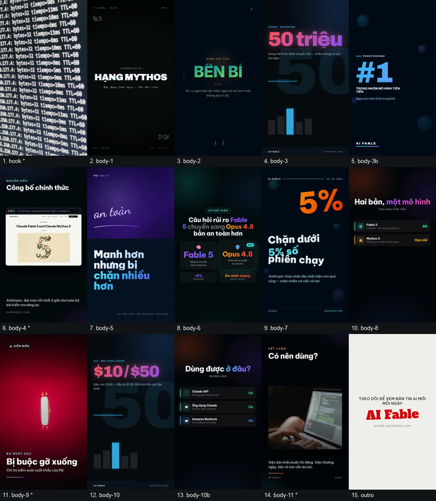
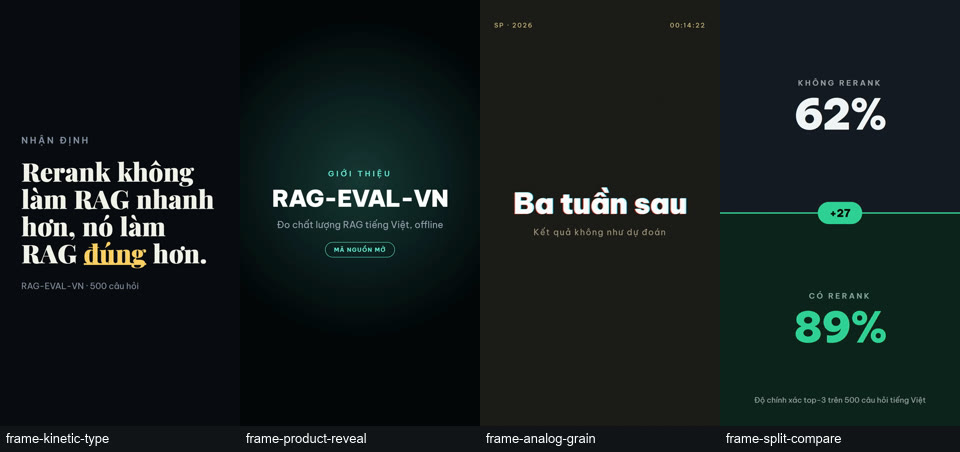
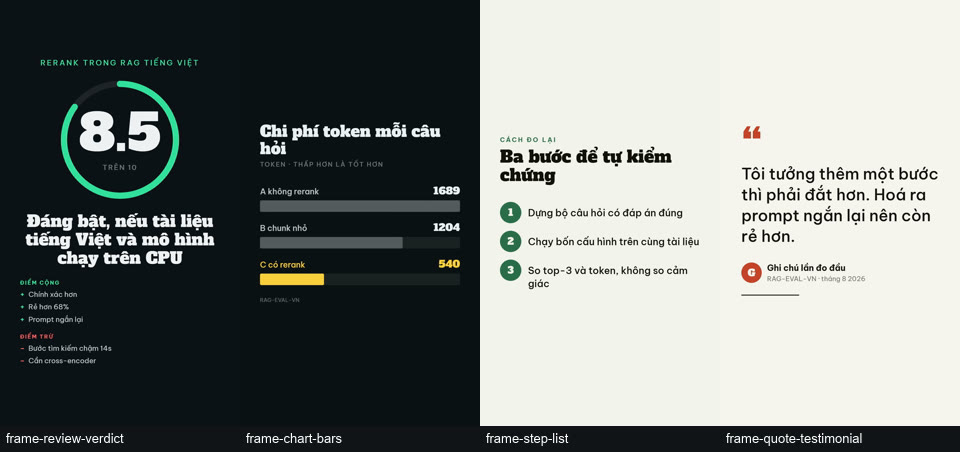

<div align="center">

# content-agent-kit

**Nói cho IDE agentic biết bạn muốn xuất bản gì. Nó đọc repo này rồi tự dựng agent.**

[](https://github.com/XuHo-IT/Content-Agent-Kit/actions/workflows/ci.yml)
[](LICENSE)
[](#y%C3%AAu-c%E1%BA%A7u)
[](#y%C3%AAu-c%E1%BA%A7u)
[](https://github.com/XuHo-IT/Content-Agent-Kit/discussions)
[](CONTRIBUTING.md)

**🇻🇳 Tiếng Việt** · [English](README.en.md)

</div>

---

Bộ kit tái sử dụng để **dựng agent nội dung tự động** trong IDE agentic (**Claude Code** và
**Antigravity / Gemini**). Clone về, nói cho AI biết bạn muốn làm gì, nó đọc repo này rồi tự
dựng một agent riêng cho dự án của bạn: một *playbook* (nguồn sự thật duy nhất), file trạng
thái, script đăng bài, pipeline crawl tìm ý tưởng, đăng mạng xã hội, lịch chạy, một cổng review
trước khi đăng — và nếu bạn cần, **video dọc 9:16 có giọng đọc thật, cảnh quay stock và ảnh
chụp trang web**.

## Xem thử đầu ra trước đã

Trước khi bỏ công dựng agent, hãy xem thứ nó làm ra. Cùng **một nguồn** — công bố Claude Fable 5
của Anthropic — cho ra **hai định dạng**:

| | |
|---|---|
| 📄 **[Bài viết mẫu](examples/ai-news-social/sample-output/)** | 951 từ tiếng Việt — thân bài là **văn bản thuần**, meta/slug nằm ở trường riêng; kèm comment engagement và bảng đối chiếu 10 tiêu chí rubric |
| 🖼️ **[Ảnh cover](examples/ai-news-social/sample-output/cover.jpg)** | 1024×1024, đi kèm bài viết trên |
| 🎬 **[Video mẫu](examples/ai-video-social/sample-output/)** | 2 phút 12 giây · 1080×1920 · giọng Vbee thật · B-roll Pexels · ảnh chụp trang gốc |

[](examples/ai-video-social/sample-output/)

**[▶️ Tải video mp4 (15,5 MB)](https://github.com/XuHo-IT/Content-Agent-Kit/releases/tag/v0.1.0)**
· hoặc render lại chính nó: `node scripts/video/render.mjs examples/ai-video-social/sample-output/script.json`

Và một **[mẫu thể loại review](examples/ai-video-social/sample-review-rag/)** — 8 scene, 80 giây,
mọi con số đều đo thật từ [RAG-EVAL-VN](https://github.com/XuHo-IT/RAG-EVAL-VN), dành hẳn một
scene cho **cái giá phải trả**: review chỉ liệt kê điểm tốt là quảng cáo, người xem nhận ra ngay.

Cùng chủ đề tin tức còn có **[bản nền trắng chữ xanh biển](examples/ai-video-social/sample-output-paper-blue/)**
— 16 scene, dùng 14 trong số 22 template, đổi hẳn bảng màu chỉ bằng `"theme": "paper-blue"`:
**không fork template nào, không sửa một dòng CSS nào trong `video-templates/`.**

### Hai mươi hai template, bốn cái mới nhất

[](video-templates/CATALOG.md)

**Chữ động** — từng chữ hiện theo nhịp đọc thay vì cả khối hiện cùng lúc. **Lộ diện sản
phẩm** — màn chắn kéo đi và tên hiện lên phía sau, một cử động chứ không phải hai animation
tình cờ kết thúc cùng nhau. **Hạt nhiễu analog** — quang sai màu vẽ bằng cách in chữ ba lần
lệch nhau, đúng bản chất của nó chứ không phải filter mô phỏng. **So sánh hai trạng thái** —
`clip-path` quét, đường kẻ đi cùng chiều với phần nó đang mở ra.

Cả bốn không kèm file ảnh nào: hạt nhiễu là SVG nội tuyến, còn lại thuần CSS.

### Bốn cái trước đó

[](video-templates/CATALOG.md)

**Review có điểm số**, **biểu đồ cột**, **danh sách bước**, **trích dẫn**. Mỗi cái đều vẽ từ
dữ liệu chứ không phải từ giá trị gõ tay — vòng cung điểm tính từ `score`/`maxScore`, độ dài
cột tính từ chính con số, nên hình không thể mâu thuẫn với chữ. Slot và giới hạn ký tự từng
cái ở **[`CATALOG.md`](video-templates/CATALOG.md)**.

Hai dải trên dựng lại được bằng một lệnh, nội dung nằm trong một file chứ không phải trong
đầu ai:

```bash
node scripts/video/template-sheet.mjs --preset 2026 \
  --inputs examples/gallery/gallery-inputs.json --out examples/gallery/templates-2026.jpg
```

Không biết dùng khung nào cho loại video nào? **[`docs/21-video-genres.md`](docs/21-video-genres.md)** và **[`VIDEO_GENRES.template.json`](templates/VIDEO_GENRES.template.json)**
có sẵn trình tự cho sáu thể loại: review, hướng dẫn, bản tin, listicle, ra mắt, testimonial.

## Mô hình vận hành

```
                       ┌──────────── PLAYBOOK.md (nguồn sự thật duy nhất) ───────────┐
                       │  nhịp đăng · schema · chuẩn chất lượng · bậc · dọn dẹp     │
                       └─────────────────────────────────────────────────────────────┘
 (tuỳ chọn)                                     │ AI đọc lại mỗi lượt chạy
 [cron] → crawl.py (crawl4ai) → hàng đợi ý tưởng┤
          sources.yaml, dedup qua queue API     ▼
                              fan-out subagent → cổng REVIEW → đăng web + social (Make.com)
                                     │                              │
                              trạng thái: queue/ledger/history  báo cáo → brain/<id>/report.md

 (tuỳ chọn) item VIDEO đi thêm hai chặng trước cổng review:
     script.json → validate-script.mjs → resolve media ──► render.mjs → video.mp4
     (AI viết)     schema + luật craft    Pexels/Pixabay    TTS · SFX · template
                                          + ảnh chụp        · ffmpeg
```

**Tám ý tưởng cốt lõi**, rút ra từ những agent chạy thật — chi tiết ở [`docs/`](docs/):

| | |
|---|---|
| **Playbook là nguồn sự thật** | Agent đọc lại `PLAYBOOK.md` mỗi lượt, không dựa vào trí nhớ hội thoại |
| **Trạng thái là file phẳng** | `queue` · `ledger` · `history`. Mọi thao tác idempotent — `409` nghĩa là "xong rồi" |
| **Cổng review** | Một subagent độc lập duyệt trước khi đăng; trượt → sửa 2–3 vòng → bỏ và ghi log |
| **Chất lượng viết được cưỡng chế** | `WRITING_CRAFT.md` đọc *trước khi* viết, rubric đo được chấm *trước khi* đăng |
| **Bài đăng là văn bản thuần** | Caption không render markdown; `validate-post.mjs` chặn trước khi gửi |
| **Bí mật chỉ nằm trong env** | Không token hay URL nào hardcode; thiếu biến thì báo lỗi rõ, không âm thầm thay thế |
| **Lịch chạy** | `cron` GitHub Actions, `schtasks` Windows, hoặc scheduler in-process |
| **Video: AI viết, code dựng** | AI lo `script.json`; validator biến luật soạn thảo thành lỗi máy kiểm được, nên script sai hỏng trong vài giây thay vì sau năm phút render |

## Bắt đầu nhanh

**Claude Code**

1. Clone repo này cạnh (hoặc vào trong) dự án của bạn.
2. Copy skill: `cp -r skills/* .claude/skills/` (hoặc trỏ Claude Code vào đó).
3. Chạy meta-skill **`/bootstrap-content-agent`** — AI phỏng vấn bạn rồi dựng agent mới.

**Antigravity / Gemini**

1. Clone repo này vào workspace.
2. Bảo agent: *"Đọc `AGENTS.md` và `docs/`, rồi dựng cho tôi một agent làm việc X."*
3. Nó đọc `skills/bootstrap-content-agent/SKILL.md` như một tài liệu chỉ dẫn thông thường.

Hằng ngày thì chạy **`/daily-run`** — hoặc `schedule-prompt.md` được sinh ra, đặt trên cron.

## Bên trong có gì

| Đường dẫn | Nội dung |
|---|---|
| `docs/` | Phương pháp luận, song ngữ EN + VI, 22 tài liệu ngắn — gồm **`12-writing-craft.md`**, `14-video-generation.md`, **`15-media-sources.md`** (B-roll và ảnh chụp), **`16-template-registry.md`**, **`17-skills-registry.md`**, **`18-ads-and-marketing.md`**, **`19-design-canva.md`**, **`20-video-backends.md`**, **`21-video-genres.md`** và **`22-repurposing.md`**. |
| `templates/` | Khung điền sẵn: `PLAYBOOK`, **`WRITING_CRAFT`**, **`VIDEO_CRAFT`**, `KNOWLEDGE`, **`VIDEO_SCRIPT.json`**, `sources.yaml`, file trạng thái, workflow cron. |
| `scripts/` | CLI **chạy được thật**: publish/append/update, queue client, `social/make-post` (ảnh **hoặc video**, đa nền tảng), `crawl/crawl.py`, `audit-quality`, scheduler, **`video/`** (validate, render, `tts-check`, `contact-sheet`, `add-template`) và **`media/`** (B-roll kho mở, ảnh chụp web, host upload). Tất cả env-only. |
| `video-templates/` | 22 template video HTML một-file cùng **`CATALOG.md`** — đủ slot và giới hạn ký tự từng cái. Mỗi file tự chứa CSS và animation, nhưng vẫn `<link>` font từ Google Fonts nên lúc render cần mạng. 146 template nữa chỉ cách một câu lệnh. |
| `skills/` | 11 skill cho Claude Code: **`bootstrap-content-agent`** (meta-skill), `daily-run`, `review-gate`, `audit-and-fix`, `crawl-and-queue`, **`create-video`**, **`video-and-post`**, **`research-and-capture`**, **`ads-report`**, **`design-campaign`**, **`repurpose`** — cộng `registry.json` liệt kê 13 skill ngoài tải theo yêu cầu. |
| `examples/ai-news-social/` | Một agent mẫu hoàn chỉnh: agent tin AI (crawl → viết → ảnh → web + Make.com → cron). |
| `examples/ai-video-social/` | Bản video của agent đó: crawl → `script.json` → render 9:16 → TikTok / Shorts / Reels. |

## Video

Tuỳ chọn. Ba bộ dựng — `html` (mặc định, miễn phí, Chrome + FFmpeg), `api` (Veo/Imagen, **tính
tiền theo giây**), `remotion`. `script.json` giữ nguyên định dạng cho cả ba.

```bash
node scripts/video/tts-check.mjs                                          # nghe thử giọng
node scripts/video/validate-script.mjs brain/<slug>/script.json --strict   # vài giây
node scripts/video/render.mjs          brain/<slug>/script.json            # ~3–5 phút
node scripts/video/contact-sheet.mjs   brain/<slug>/video.mp4              # rồi NHÌN nó
```

| | |
|---|---|
| **6 nhà cung cấp giọng** | `omnivoice` (local, miễn phí) · elevenlabs · vbee · fptai · viettel · `http` (adapter env-only). Lời đọc được đánh vân tay nên đổi giọng chỉ đọc lại phần cần |
| **Cảnh quay và ảnh chụp thật** | Pexels/Pixabay + Chrome headless. Ghim vào `media-lock.json` → cùng script cho ra cùng video |
| **Phụ đề tự ra, không cần CapCut** | `--captions burn` đốt thẳng vào hình. Mốc đầu mỗi cảnh chính xác tuyệt đối; trong cảnh chia theo số ký tự — nói rõ là ước lượng chứ không phải forced alignment |
| **Chuyển cảnh** | `fade · swipe · slide · iris · pixelize`. Thời lượng video **không đổi** — phần đệm được tính để phần chồng ăn lại đúng bằng nó |
| **Bảng màu từ website của bạn** | `theme-from-url.mjs --url <site>` đọc nền/mực/nhấn ngay trên trang, theo đúng luật tương phản WCAG mà validator đang áp |
| **22 template, 6 thể loại** | `VIDEO_GENRES.template.json` trả lời "làm review thì dùng khung nào, theo thứ tự nào" |
| **Một bảng màu cho cả video** | `"theme": "paper-blue"` sơn lại toàn bộ trên **bản sao tạm**; chiều lật sáng/tối là **đo bằng Chrome**, không đoán từ CSS |
| **Nhìn lại thứ vừa làm ra** | `contact-sheet.mjs` gom mỗi scene một khung vào một ảnh. Bốn lỗi từng lọt qua mọi luật đều lộ ra trong một cái nhìn |

Render cần máy thật — **GitHub Actions không làm được**.
Chi tiết: [`docs/14-video-generation.md`](docs/14-video-generation.md) ·
[`docs/20-video-backends.md`](docs/20-video-backends.md) ·
[`docs/16-template-registry.md`](docs/16-template-registry.md)

## Yêu cầu

| | Khi nào cần |
|---|---|
| **Node ≥ 18** | luôn luôn |
| Python 3.12 + `scripts/crawl/requirements.txt` | chỉ khi crawl tìm ý tưởng |
| **FFmpeg + ffprobe** và **Chrome/Chromium** | chỉ khi dùng pipeline video |
| API key TTS *hoặc* server OmniVoice local | chỉ khi render video thật |

**Không `package.json`, không `node_modules`** — đó là lý do kit copy được vào bất kỳ dự án nào
mà không cần bước cài. Thứ duy nhất không tự viết lại được, engine HTML→MP4, do `npx` tải lúc
render và đã ghim phiên bản. Ràng buộc này chịu lực thật: phần ký AWS SigV4 cho Cloudflare R2
viết bằng `node:crypto` và đối chiếu với chính vector chuẩn AWS công bố
(`node scripts/media/host-check.mjs --selftest`).

## An toàn

- **Không bao giờ commit `.env`.** Script chỉ đọc env; thiếu biến thì báo lỗi rõ ràng, không âm thầm thay thế.
- **URL webhook Make.com chính là bí mật** — nó không có header xác thực. Ai biết URL thì đăng được lên kênh của bạn. Đối xử với nó như mật khẩu.
- **Bản quyền:** crawler chỉ lưu **trích đoạn** (≤1500 ký tự) kèm link nguồn, không bao giờ lưu toàn văn. Hãy viết lại và tóm tắt bằng lời của bạn.

Mô hình đầy đủ và cách báo lỗi bảo mật: **[`SECURITY.md`](SECURITY.md)**.

## Đóng góp

Đóng góp giá trị nhất đến từ người đã thực sự chạy nó — một nhà cung cấp giọng ở nước bạn, một
template mới, một luật craft mà bạn thấy AI hay vi phạm. **Không có bước cài đặt**: clone rồi
chạy; CI cũng chạy offline, không cần key nào.

[Issues](https://github.com/XuHo-IT/Content-Agent-Kit/issues) ·
[Discussions](https://github.com/XuHo-IT/Content-Agent-Kit/discussions) ·
[`CONTRIBUTING.md`](CONTRIBUTING.md) · lỗi bảo mật thì **đừng mở issue**, xem
[`SECURITY.md`](SECURITY.md)

**Adapter chưa kiểm chứng:** Cloudflare R2, Cloudinary, Viettel AI và backend video `api` viết
theo tài liệu chính thức nhưng **chưa từng chạy với credential thật**. Chúng tự khai điều đó
(`host-check.mjs --hosts`, `tts-check.mjs --providers`, `docs/20`). Có tài khoản và xác nhận
được một cái chạy? PR đổi cờ ấy là đóng góp rất được việc.

## Giấy phép

MIT — xem [`LICENSE`](LICENSE).

Pipeline video và các template kế thừa từ mã nguồn mở MIT / Apache-2.0
([AI-auto-generate-video](https://github.com/huytranvan2010/AI-auto-generate-video),
[nexu-io/html-video](https://github.com/nexu-io/html-video),
[heygen-com/hyperframes](https://github.com/heygen-com/hyperframes)). Phần ghi công nằm ở
**[`NOTICE.md`](NOTICE.md)** và trong từng `video-templates/*/NOTICE.md`, bản đầy đủ của
Apache-2.0 nằm ở [`LICENSES/Apache-2.0.txt`](LICENSES/Apache-2.0.txt) — hãy giữ nguyên các
file đó, chúng là **điều kiện giấy phép** chứ không phải phép lịch sự.
