<div align="center">

# content-agent-kit

**Automated multi-channel content toolkit: crawl ideas, write SEO/GEO-optimized posts, gate review, and generate high-impact 9:16 vertical videos.**

[](https://github.com/XuHo-IT/Content-Agent-Kit/actions/workflows/ci.yml)
[](LICENSE)
[](#requirements)
[](#requirements)
[](https://github.com/XuHo-IT/Content-Agent-Kit/discussions)
[](CONTRIBUTING.md)

**English** · [🇻🇳 Tiếng Việt](README.vi.md)

</div>

---

A modular scaffolding kit enabling agentic IDEs (**Claude Code**, **Antigravity / Gemini**) to autonomously build and operate production-grade Content Agents: idea ingestion, editorial writing, quality auditing, social publishing, and **vertical 9:16 video generation** powered by 106 single-file HTML templates, realistic TTS narration, stock B-roll, and live web captures.

## Sample Outputs

| Format | Description & Links |
|---|---|
| 📄 **Article** | [Sample Post](examples/ai-news-social/sample-output/) — SEO/GEO-compliant article with engagement prompts and 10-point quality audit |
| 🖼️ **Cover Image** | [Cover Image](examples/ai-news-social/sample-output/cover.jpg) — 1024×1024 visual asset matching the article |
| 🎬 **9:16 Video** | [Sample Video](examples/ai-video-social/sample-output/) — 2m 12s, natural TTS narration, Pexels footage, live website capture |
| 🎨 **Theme Repainting** | [Paper-Blue Sample](examples/ai-video-social/sample-output-paper-blue/) — 16 scenes across 14 of the 106 templates, repainted to white-and-ocean-blue via `"theme": "paper-blue"` |

> **Download Sample MP4:** [Releases v0.1.0](https://github.com/XuHo-IT/Content-Agent-Kit/releases/tag/v0.1.0) or render locally:
> `node scripts/video/render.mjs examples/ai-video-social/sample-output/script.json`

---

## 🚀 End-to-End Workflow & Architecture

[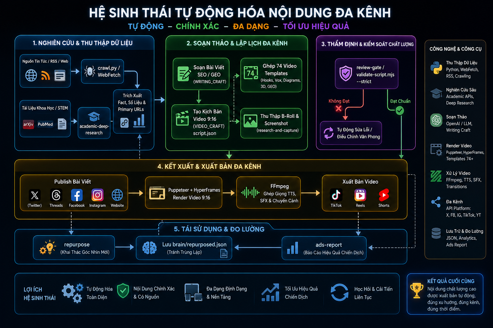](examples/gallery/workflow.png)

---

## 106 Scene Templates (Organized by Visual Category)

All 106 templates are structured into **14 distinct visual categories** with dedicated aesthetic identities:

### 1. 🌟 Hooks & Attention Openers (Hooks & Heroes — 8 templates)
[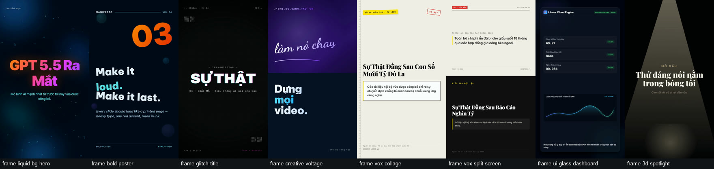](video-templates/CATALOG.md)
*Includes: `frame-liquid-bg-hero`, `frame-bold-poster`, `frame-glitch-title`, `frame-creative-voltage`, `frame-vox-collage`, `frame-vox-split-screen`, `frame-ui-glass-dashboard`, `frame-3d-spotlight`.*

### 2. 📰 Visual Journalism & Statements (Vox, Statements & Typography — 10 templates)
[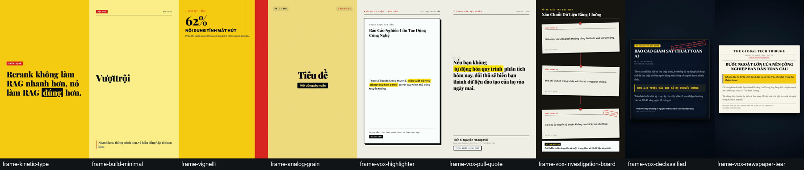](video-templates/CATALOG.md)
*Includes: `frame-kinetic-type`, `frame-build-minimal`, `frame-vignelli`, `frame-analog-grain`, `frame-vox-highlighter`, `frame-vox-pull-quote`, `frame-vox-investigation-board`, `frame-vox-declassified`, `frame-vox-newspaper-tear`, `frame-vox-photo-grid`.*

### 3. 📊 Data, Charts & Technical Metrics (Data, Charts & Analytics — 13 templates)
[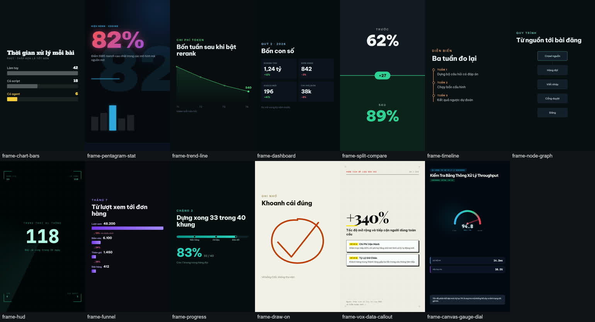](video-templates/CATALOG.md)
*Includes: `frame-chart-bars`, `frame-pentagram-stat`, `frame-trend-line`, `frame-dashboard`, `frame-split-compare`, `frame-timeline`, `frame-node-graph`, `frame-hud`, `frame-funnel`, `frame-progress`, `frame-draw-on`, `frame-vox-data-callout`, `frame-canvas-gauge-dial`.*

### 4. 🧠 Diagrams, Math & Architecture (Diagrams, Math & Architecture — 8 templates)
[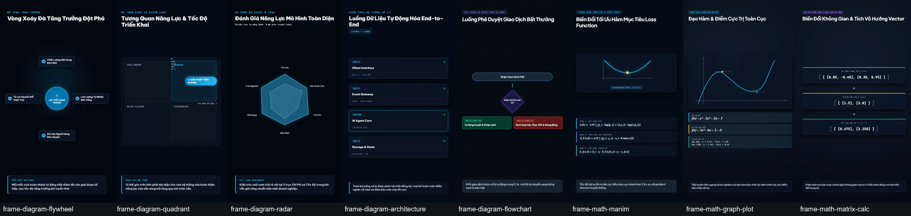](video-templates/CATALOG.md)
*Includes: `frame-diagram-flywheel`, `frame-diagram-quadrant`, `frame-diagram-radar`, `frame-diagram-architecture`, `frame-diagram-flowchart`, `frame-math-manim`, `frame-math-graph-plot`, `frame-math-matrix-calc`.*

### 5. 💻 Footage, Developer IDE & 3D (Footage, IDE & 3D — 11 templates)
[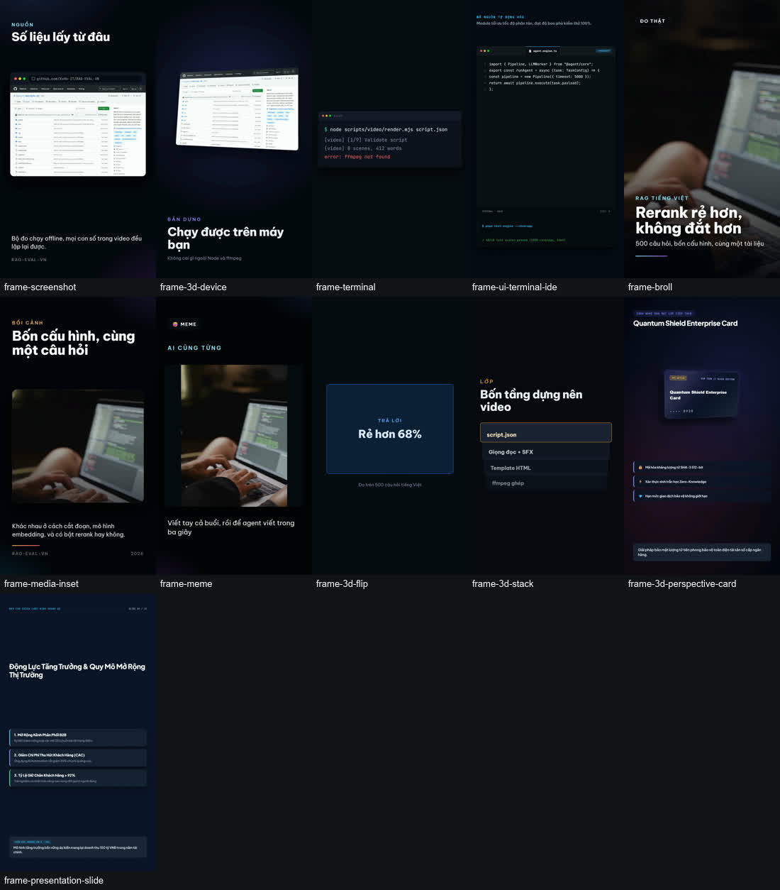](video-templates/CATALOG.md)
*Includes: `frame-screenshot`, `frame-3d-device`, `frame-terminal`, `frame-ui-terminal-ide`, `frame-broll`, `frame-media-inset`, `frame-meme`, `frame-3d-flip`, `frame-3d-stack`, `frame-3d-perspective-card`, `frame-presentation-slide`.*

### 6. 🗺️ Maps, Local & Travel (GEO, Radar, Heatmap & Local — 10 templates)
[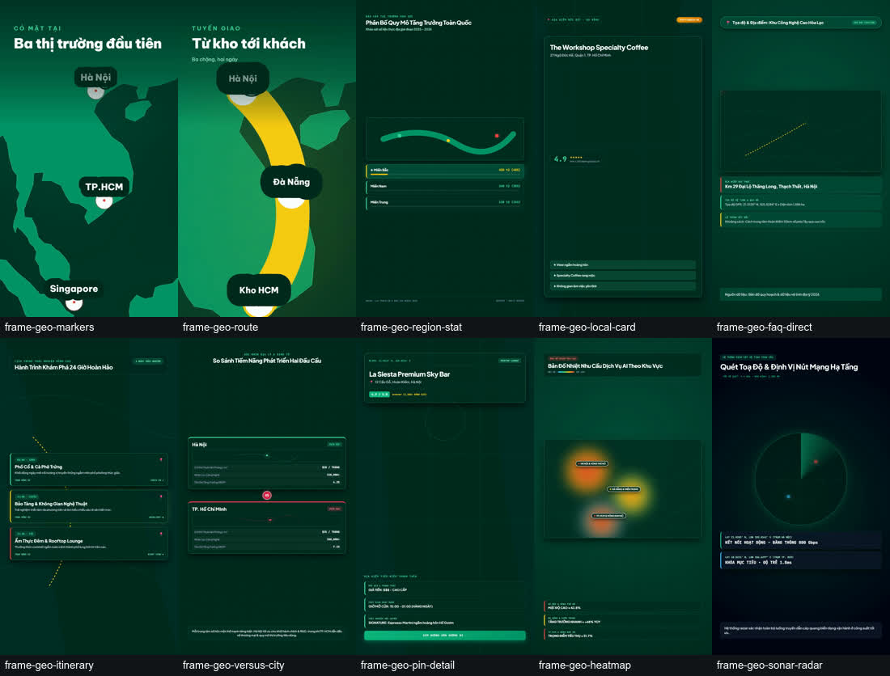](video-templates/CATALOG.md)
*Includes: `frame-geo-markers`, `frame-geo-route`, `frame-geo-region-stat`, `frame-geo-local-card`, `frame-geo-faq-direct`, `frame-geo-itinerary`, `frame-geo-versus-city`, `frame-geo-pin-detail`, `frame-geo-heatmap`, `frame-geo-sonar-radar`.*

### 7. 🏆 Sequences, Proof, Fitness & Closers (Sequences, Fitness & Closers — 14 templates)
[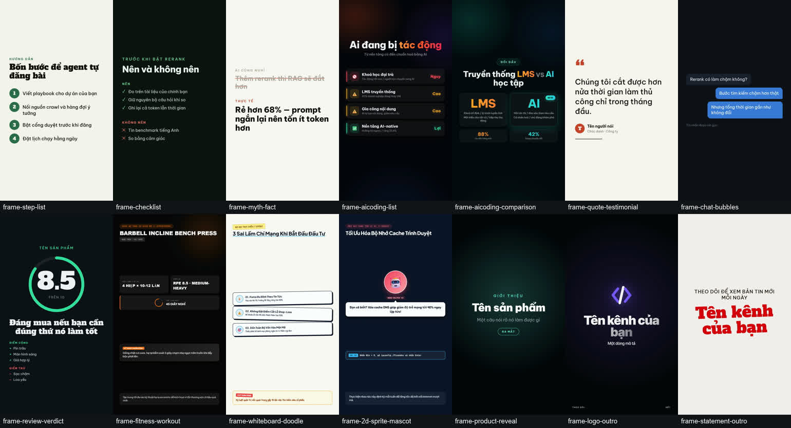](video-templates/CATALOG.md)
*Includes: `frame-step-list`, `frame-checklist`, `frame-myth-fact`, `frame-aicoding-list`, `frame-aicoding-comparison`, `frame-quote-testimonial`, `frame-chat-bubbles`, `frame-review-verdict`, `frame-fitness-workout`, `frame-whiteboard-doodle`, `frame-2d-sprite-mascot`, `frame-product-reveal`, `frame-logo-outro`, `frame-statement-outro`.*

### 8. ⚡ Multi-Skill Hybrid Templates (Multi-Skill Hybrid — 2 templates)
[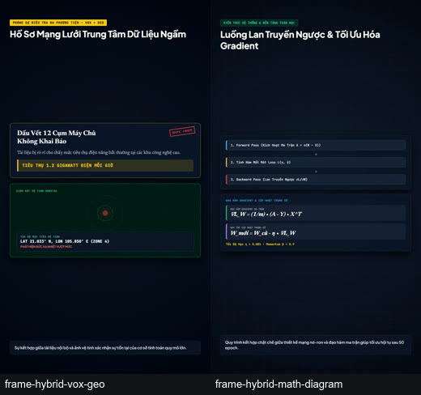](video-templates/CATALOG.md)
*Includes: `frame-hybrid-vox-geo` (Vox Journalism + Satellite Radar Map), `frame-hybrid-math-diagram` (System Architecture + Manim Calculus).*

### 9. 📈 FinTech, Crypto & Trading (FinTech & Trading — 5 templates)
[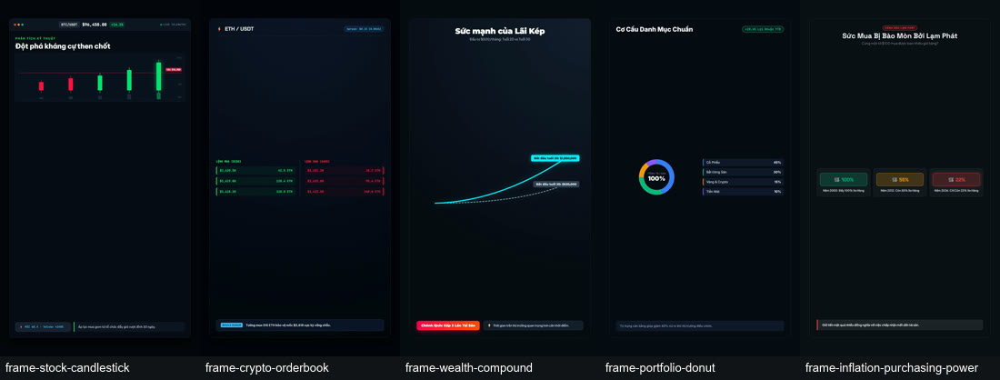](video-templates/CATALOG.md)
*Includes: `frame-stock-candlestick`, `frame-crypto-orderbook`, `frame-wealth-compound`, `frame-portfolio-donut`, `frame-inflation-purchasing-power`.*

### 10. 🧠 Science, Psychology & Edu-Tech (Science & Psychology — 5 templates)
[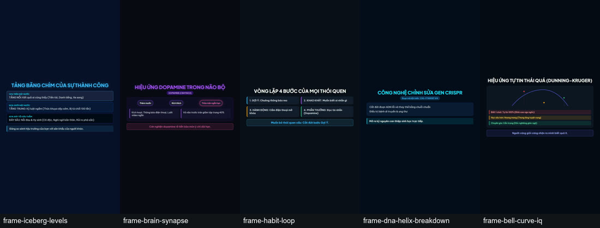](video-templates/CATALOG.md)
*Includes: `frame-iceberg-levels`, `frame-brain-synapse`, `frame-habit-loop`, `frame-dna-helix-breakdown`, `frame-bell-curve-iq`.*

### 11. 🕵️‍♂️ Documentary, Investigation & Business Wars (Documentary & Crime — 5 templates)
[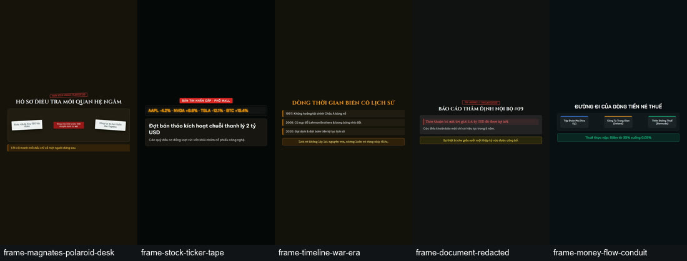](video-templates/CATALOG.md)
*Includes: `frame-magnates-polaroid-desk`, `frame-stock-ticker-tape`, `frame-timeline-war-era`, `frame-document-redacted`, `frame-money-flow-conduit`.*

### 12. 🎮 Gamification, Viral Hooks & High-Retention (Viral Retention Hooks — 5 templates)
[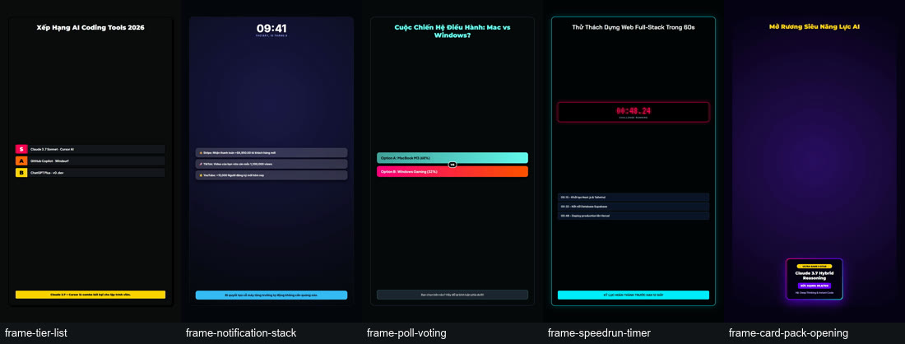](video-templates/CATALOG.md)
*Includes: `frame-tier-list`, `frame-notification-stack`, `frame-poll-voting`, `frame-speedrun-timer`, `frame-card-pack-opening`.*

### 13. 💻 SaaS, AI Tooling & Dev Engineering (Dev & Tech Explainers — 5 templates)
[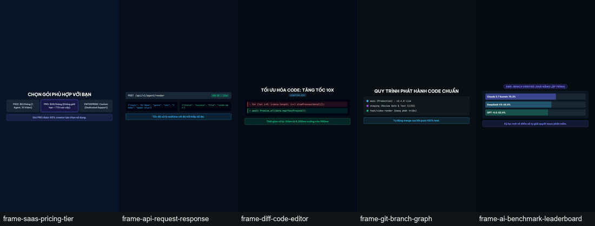](video-templates/CATALOG.md)
*Includes: `frame-saas-pricing-tier`, `frame-api-request-response`, `frame-diff-code-editor`, `frame-git-branch-graph`, `frame-ai-benchmark-leaderboard`.*

### 14. ⚖️ E-Commerce, Unboxing & Honest Reviews (E-Commerce & Reviews — 5 templates)
[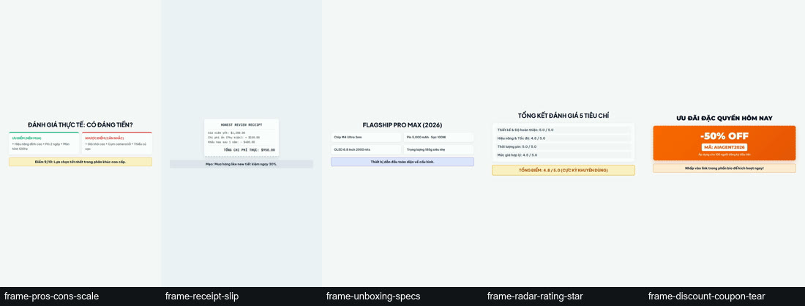](video-templates/CATALOG.md)
*Includes: `frame-pros-cons-scale`, `frame-receipt-slip`, `frame-unboxing-specs`, `frame-radar-rating-star`, `frame-discount-coupon-tear`.*

> Slot contracts and character limits: **[`video-templates/CATALOG.md`](video-templates/CATALOG.md)**.
> Scene sequences across 12 genres: **[`docs/21-video-genres.md`](docs/21-video-genres.md)** & **[`templates/VIDEO_GENRES.template.json`](templates/VIDEO_GENRES.template.json)**.

---

## Repository Structure

| Directory | Role |
|---|---|
| `docs/` | 22 concise methodology guides (bilingual EN + VI): SEO/GEO writing, video pipeline, media sourcing, theme palettes, ad MCPs, and repurposing |
| `templates/` | Scaffolds: `PLAYBOOK`, `WRITING_CRAFT`, `VIDEO_CRAFT`, `KNOWLEDGE`, `VIDEO_SCRIPT.json`, `sources.yaml`, `INDUSTRIES.template.json` (16 industries) |
| `scripts/` | Working zero-dependency CLIs: crawl engine, social publisher, quality auditor, video renderer, stock B-roll search, screenshot capture |
| `video-templates/` | 106 single-file HTML video templates plus **`CATALOG.md`** — each carries self-contained CSS & animations for offline rendering. 176 more are one command away. |
| `skills/` | 16 runtime skills: `bootstrap-content-agent`, `daily-run`, `review-gate`, `audit-and-fix`, `crawl-and-queue`, `topic-radar`, `daily-topic-video`, `create-video`, `video-and-post`, `research-and-capture`, `repurpose`, `ads-report`, `design-campaign`, `geo-optimize`, `motion-craft`, `new-template` + `registry.json` (23 on-demand skills). |
| `examples/` | 2 end-to-end reference implementations: AI News Social Agent and Vertical Video Production Agent |

---

## Quickstart in 3 Steps

### 1. Scaffold a New Agent
- **Claude Code:** Run `/bootstrap-content-agent` — the AI interviews you and scaffolds your custom agent.
- **Antigravity / Gemini:** Prompt: *"Read `AGENTS.md` and `docs/`, then build a content agent for [topic]."*

### 2. Daily Execution
- Run `/daily-run` to crawl fresh ideas, draft content, audit against the review gate, and publish to social channels.

### 3. Generate Videos (Optional)
```bash
# 1. Validate script syntax and craft rules (seconds)
node scripts/video/validate-script.mjs brain/<slug>/script.json --strict

# 2. Render final MP4 (with TTS narration & media)
node scripts/video/render.mjs brain/<slug>/script.json

# 3. Generate a visual contact sheet
node scripts/video/contact-sheet.mjs brain/<slug>/video.mp4
```

---

## Key Capabilities

| Capability | Details |
|---|---|
| **6 Voice Providers** | OmniVoice (local, free), Vbee, Viettel AI, FPT AI, ElevenLabs, HTTP custom adapter |
| **Real Footage & Captures** | Automatic stock B-roll fetching from Pexels/Pixabay + headless Chrome web captures |
| **Burned Captions & Transitions** | In-frame captions (`--captions burn`), 5 cinematic transitions (fade, swipe, slide, iris, pixelize) |
| **Instant URL Theming** | Extract brand colors directly from any website using `theme-from-url.mjs` |
| **106 templates, 12 genres** | 12 complete video genres: Review, Tutorial, News, Listicle, Launch, Testimonial, Local GEO, Vox Explainer, Math Derivation, Architecture, Travel |
| **GEO / Answer Engine Optimization** | `geo-audit.mjs` validates content for AI citation readiness (SearchGPT, Perplexity, Google Overviews) |

---

## Requirements

- **Node.js ≥ 18** (Required)
- **Chrome/Chromium + FFmpeg/ffprobe** (Required for video rendering)
- **Python 3.12** (Only needed when using the optional `crawl4ai` pipeline)

> **Zero `npm install` / No `package.json`**: The kit is fully self-contained and portable across any workspace.

## License & Attribution

- License: **MIT** (see [`LICENSE`](LICENSE)).
- Lineage & third-party attributions: see **[`NOTICE.md`](NOTICE.md)**.
