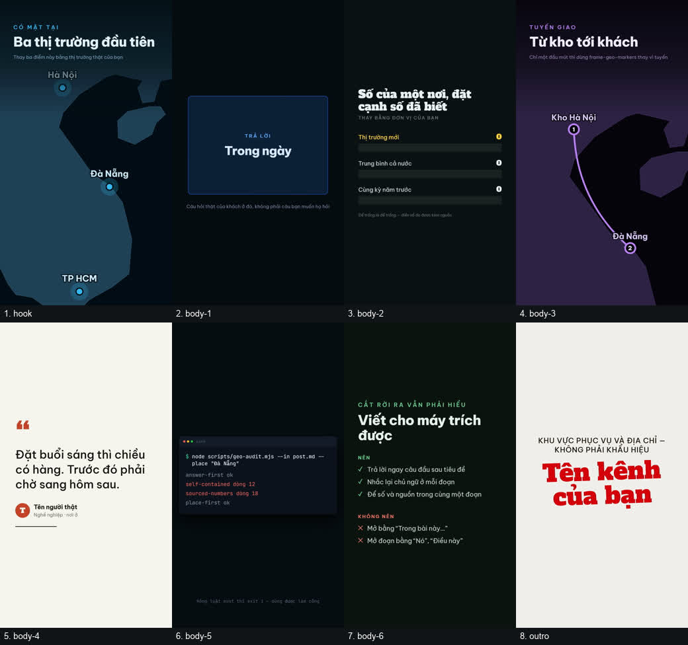

# Sample — GEO, cả hai nghĩa

Hai thứ khác hẳn nhau cùng được gọi là GEO. Thư mục này có cả hai, vì người dùng hỏi "làm
GEO" thì có thể đang hỏi một trong hai, và làm nhầm thì mất cả buổi.

| nghĩa | là gì | ở đây là |
|---|---|---|
| **G**enerative **E**ngine **O**ptimization | viết sao cho máy trả lời **trích được** | `post-draft.md` → `geo-report.md` → `post-fixed.md` |
| geography | câu chuyện nằm ở **nơi chốn** | `script.json` → `frames.jpg` |

## Nửa địa lý — thể loại `local`



`script.json` là thể loại **`local`** trong
[`VIDEO_GENRES.template.json`](../../../templates/VIDEO_GENRES.template.json): mở bằng bản đồ,
hỏi câu người ở đó thật sự hỏi, đặt con số cạnh con số đã biết, vẽ tuyến nếu có gì di chuyển,
rồi để một người ở đó nói.

**Khác `sample-review-rag` ở một điểm quan trọng:** ở đó mọi con số là số đo thật từ
RAG-EVAL-VN. Ở đây **các con số là chỗ trống, và bản thân khung nói ra điều đó** — cột biểu đồ
để `0`, chú thích ghi "Để trống là để trống — điền số đo được kèm nguồn". Sample này cho thấy
**hình dạng** của một video về nơi chốn; số liệu là thứ bạn phải mang tới.

Dựng lại ảnh trên bằng một lệnh, **không tốn một ký tự TTS nào**:

```bash
node scripts/video/template-sheet.mjs --script examples/ai-video-social/sample-geo/script.json \
  --per-row 4 --width 260 --out examples/ai-video-social/sample-geo/frames.jpg
```

Muốn ra video thật thì `node scripts/video/render.mjs examples/ai-video-social/sample-geo/script.json`
— cần khoá TTS, và cần bạn thay hết chỗ trống trước đã.

> **Bản đồ không gọi mạng.** Cả `frame-geo-markers` lẫn `frame-geo-route` vẽ từ
> `video-templates/world-path.json` đã commit sẵn — không tải tile, nên không có khoá API và
> không có nghĩa vụ ghi công nào. Chi tiết phép chiếu ở `CATALOG.md`.

## Nửa máy trả lời — `geo-audit.mjs`

Ba file, đọc theo thứ tự, là toàn bộ ý:

1. **[`post-draft.md`](post-draft.md)** — bản nháp nghe hoàn toàn bình thường.
2. **[`geo-report.md`](geo-report.md)** — kết quả chấm, commit sẵn để đọc không cần chạy.
3. **[`post-fixed.md`](post-fixed.md)** — cùng nội dung, viết lại cho trích được.

```bash
node scripts/geo-audit.mjs --in examples/ai-video-social/sample-geo/post-draft.md --place "Đà Nẵng"
# not-quotable, exit 1

node scripts/geo-audit.mjs --in examples/ai-video-social/sample-geo/post-fixed.md --place "Đà Nẵng"
# quotable, exit 0
```

Bản nháp hỏng **tám** chỗ. Ba chỗ đáng nói nhất:

- *"Nó giảm còn một phần ba so với trước."* — **Nó** là cái gì? Trên trang thì rõ, bị trích ra
  một mình thì không. Bản sửa nhắc lại chủ ngữ, chấp nhận nghe hơi thừa.
- *"Tỷ lệ giao đúng hẹn đạt 94%."* — không nói lấy ở đâu. Nguồn nằm ở đoạn khác thì không đi
  cùng câu được trích. Bản sửa viết "94%, theo log điều phối nội bộ quý I/2026 trên 4.180 đơn".
- *"Đà Nẵng"* chỉ xuất hiện ở mục thứ ba. Bài về một nơi mà mãi mới nhắc tên nơi đó thì cả máy
  tìm kiếm địa phương lẫn máy trả lời đều đọc là bài không nói về nơi ấy.

### Hai chỗ chính sample này bắt được lỗi của công cụ

Viết `post-fixed.md` xong thì chính nó làm lộ hai lỗi **âm tính giả** trong `geo-audit.mjs`,
và cả hai đã sửa cùng lúc — ghi lại ở đây vì đó là lý do sample này tồn tại:

- `theo log điều phối nội bộ` và `theo bảng chi phí` **không được tính là nguồn**. Luật cũ đòi
  hoặc một tên riêng viết hoa, hoặc một trong sáu từ nghiên cứu — nên một bài trích nguồn đúng
  chuẩn vẫn trượt. Đó chính xác là kiểu nhiễu khiến người ta tắt luật đi.
- `31/05/2026` bị đếm là **con số 31 chưa có nguồn**. Ngày không phải một khẳng định.

### Một điều luật này *không* làm

`answer-first` báo ✅ cho `post-draft.md` — vì bản nháp **không có tiêu đề câu hỏi nào**, nên
không có gì để trả lời sai. Luật bắt chuyện đó là `question-headings`, và nó báo đỏ. Một luật
đúng theo nghĩa rỗng vẫn là đúng; chỗ nguy hiểm là đọc một dấu ✅ đơn lẻ thay vì đọc cả bảng.

## Số liệu trong `post-fixed.md`

Là **số minh hoạ cho một tình huống hư cấu** — một dịch vụ giao hàng không có thật. Chúng có
mặt ở đây để cho thấy *hình dạng* của một câu có nguồn, chứ không khẳng định điều gì về thế
giới. Đây cũng là lý do file này nằm trong `examples/` chứ không phải trong `brain/`.
