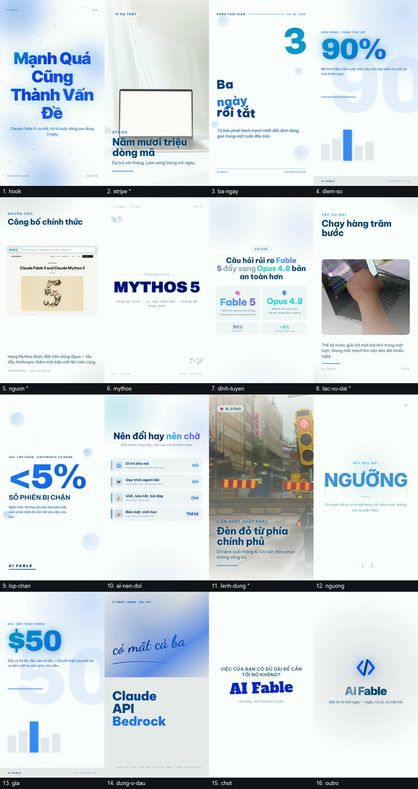

# Video mẫu 2 — nền trắng, chữ xanh biển

> Cùng nguồn, cùng chủ đề, cùng bộ template với [`sample-output/`](../sample-output/).
> Toàn bộ bảng màu do đúng một khoá trong `script.json` quyết định:
>
> ```json
> "theme": "paper-blue"
> ```
>
> Đặt hai video cạnh nhau là thấy `theme` làm được gì: **không fork template nào, không sửa
> một dòng CSS nào trong `video-templates/`.**
>
> Hai bản khác nhau nhiều hơn một dòng — kịch bản được viết lại (15 scene so với 16, lời đọc
> khác hẳn). Riêng phần **màu** thì chỉ có `theme`.

## ▶️ Xem video

**[Tải `claude-fable-5-paper-blue-1080x1920.mp4` (16,8 MB)](https://github.com/XuHo-IT/Content-Agent-Kit/releases/tag/v0.2.0)**
— kèm `voice.mp3` riêng cho CapCut.

| | |
|---|---|
| Thời lượng | 2 phút 28 giây (147,8 s) |
| Khung hình | 1080 × 1920 (9:16) |
| Số scene | 16 · 540 từ lời đọc |
| Template | **14 template khác nhau — dùng hết bộ đang có** |
| Bảng màu | `paper-blue` — nền `#ffffff`, chữ `#0a4a7a` |
| Giọng | Vbee `hn_female_ngochuyen_full_48k-fhg` |
| Media | 3 clip Pexels + 1 ảnh chụp `anthropic.com` |
| Nguồn | https://www.anthropic.com/news/claude-fable-5-mythos-5 |

## 16 scene trong một ảnh



Ảnh này **bắt được hai lỗi** mà validator không thể bắt, vì cả hai đều render thành công và
đúng số ký tự:

- scene 3 — ba dòng tiêu đề nghiêng chồng lên nhau: *"ngày"* đè lên *"rồi tắt"*
- scene 12 — chữ **NGƯỠNG** bị ngắt giữa từ thành **"NGƯỠ / G"**

Cả hai là lỗi của template khi gặp tiếng Việt, không phải lỗi chữ viết ra: một nguyên âm
tiếng Việt có thể đội cả **râu lẫn dấu thanh** (Ư, Ỡ) mà vẫn có phần đuôi thò xuống (g, y),
trong khi hai template đó đặt `line-height` dưới 1. Đã sửa tận gốc trong
`video-templates/` — xem mục cuối `CATALOG.md`.

## Vì sao lại cần cả một cơ chế theme

Đổi màu không phải là thay `#000` bằng `#fff`. Ba chỗ mà tìm-và-thay đơn thuần làm hỏng —
mỗi chỗ đều từng là một lỗi thật:

| | |
|---|---|
| **Màu nằm trong chuỗi JS/JSON** | Bỏ sót thì thẻ so sánh vẫn một bên cam một bên xanh, dù CSS đã đổi hết |
| **`mix-blend-mode: screen`** | Trên nền trắng, screen tô ra trắng — khối màu aurora và lớp glitch **biến mất không báo lỗi**. Phải lật thành `multiply` |
| **Màu nhấn tầm trung** | Cam `#ffb020` đọc rõ trên nền gần đen; lật độ sáng xong nó thành cyan **1,5:1** trên nền trắng. Phải làm tối tới khi đạt 3:1 |

Và chiều lật là **đo chứ không đoán**: `frame-statement-outro` vốn đã nền sáng, lật nữa thì
thành tối. Đọc CSS không đủ tin — `frame-bold-poster` bản 16:9 nền sáng còn bản 9:16 nền tối.
`theme-probe.mjs` chụp ảnh từng composition bằng Chrome rồi đo độ sáng thật, ghi vào
`video-templates/theme-map.json`.

Thứ theme **không** đổi được: emoji. Chúng là glyph màu, không phải CSS — 🚫 vẫn đỏ trên khung
xanh trắng. Chọn emoji với điều đó trong đầu, hoặc bỏ trống ô đó.

## Trong thư mục này có gì

| File | Là gì |
|---|---|
| `script.json` | Đầu vào — lời đọc, chọn template, chữ trên màn hình, khối `media`, và `theme` |
| `media-lock.json` | Ghim đúng clip Pexels đã dùng, kèm tác giả và giấy phép |
| `script.txt` | Lời đọc thuần cho CapCut tự tạo phụ đề |
| `contact-sheet.jpg` | Ảnh trên |

## Tự render lại

```bash
node scripts/video/validate-script.mjs examples/ai-video-social/sample-output-paper-blue/script.json --strict
node scripts/video/render.mjs          examples/ai-video-social/sample-output-paper-blue/script.json
```

Muốn xem bảng màu khác thì đổi `theme` thành `paper-ink` hoặc `paper-forest` rồi chạy lại —
clip cache tự động bị vô hiệu khi bảng màu đổi, nên không có chuyện render lại mà vẫn ra màu cũ.

Xem thử bảng màu trước khi bỏ ra năm phút render:

```bash
node scripts/video/theme-probe.mjs --preview paper-forest --aspect 9:16 --dry-run
```

## Giấy phép clip

`media-lock.json` lưu nguồn, tác giả, giấy phép từng clip. Cả ba đều từ Pexels — cho dùng
thương mại, không bắt buộc ghi nguồn — nên video không có dòng ghi công nào. Sổ vẫn giữ để
truy được về sau.
