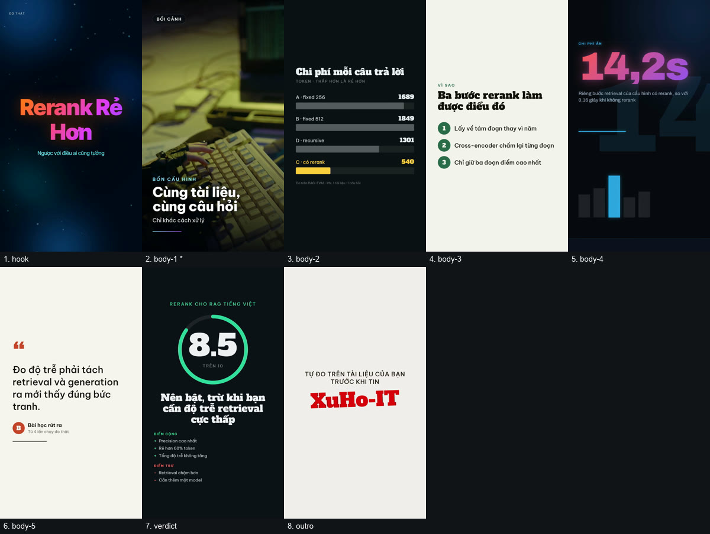

# Sample — review genre / Mẫu thể loại review



## English

A **review**, not a news bulletin. The other two samples in this folder are the same
Claude Fable 5 story told twice; this one exists because a review is shaped differently and
the difference is the point.

| | |
|---|---|
| Subject | Does reranking help a Vietnamese RAG pipeline? |
| Length | 79.9 s · 1080×1920 · 8 scenes |
| Narration | Vbee, `hn_female_ngochuyen_full_48k-fhg` — 1,252 billable characters |
| B-roll | one Pexels clip, pinned by id |
| Templates | 6 different ones, including all four added for review-style video |

Reproduce it:

```bash
export TTS_PROVIDER=vbee VBEE_TOKEN=… VBEE_APP_ID=… PEXELS_API_KEY=…
node scripts/video/render.mjs examples/ai-video-social/sample-review-rag/script.json
node scripts/video/contact-sheet.mjs examples/ai-video-social/sample-review-rag/video.mp4
```

The `.mp4` and `.mp3` are not committed — they are gitignored, like every render output.
`script.json` plus `media-lock.json` is what makes the render reproducible.

### Every number in it is measured

The claims come from real runs of
[RAG-EVAL-VN](https://github.com/XuHo-IT/RAG-EVAL-VN), not from illustration:

| | measured |
|---|---|
| Token cost, no rerank (config A) | 1,689 |
| Token cost, with rerank (config C) | 540 — **68% less** |
| Retrieval time, no rerank | 0.16 s |
| Retrieval time, with rerank | 14.2 s |
| **Total** latency, either way | ~37 s |

That last row is why the video exists. Reranking looks like a pure cost — it adds a
cross-encoder pass — and measuring it showed the opposite: filtering noisy chunks shortens
the prompt enough to pay for itself twice over, and the slower retrieval is cancelled by
faster generation.

The outro says so out loud: **one document and one question is not a result.** A sample that
overclaims teaches the wrong habit to everyone who copies it.

### How the genre shapes it

Following `templates/VIDEO_GENRES.template.json`:

| scene | template | beat |
|---|---|---|
| hook | `frame-liquid-bg-hero` | the verdict, spoiled — nobody watches a review for suspense |
| body-1 | `frame-broll` | what was measured, over footage |
| body-2 | `frame-chart-bars` | the number that carries the claim |
| body-3 | `frame-step-list` | why it happens, in three steps |
| body-4 | `frame-pentagram-stat` | the hidden cost, stated rather than buried |
| body-5 | `frame-quote-testimonial` | the lesson, pulled out as a quote |
| verdict | `frame-review-verdict` | 8.5/10 with pros and cons — the frame people screenshot |
| outro | `frame-statement-outro` | go measure it yourself |

**The hidden cost gets its own scene.** A review that lists only upsides is an
advertisement, and viewers can tell.

### What this sample caught

It was rendered while the four new templates were still new, and rendering it found two
defects nothing else could:

- `frame-chart-bars` and `frame-step-list` rendered **1920×1080 inside a 9:16 video**. Their
  CSS and viewport were right; the `data-width` / `data-height` on `#root` — which is what
  the renderer sizes from — were stale. The render succeeded, the validator passed, and a
  screenshot harness that forces the window size showed the correct layout. Only
  `contact-sheet.mjs` failed, because `hstack` cannot combine tiles of different sizes.
- `frame-liquid-bg-hero` printed `9:16` and `Bản tin` in its corners — fixed text no slot
  could reach, on every video ever made with it.

Both are fixed and both now have tests. Which is the argument for
`contact-sheet.mjs` in one paragraph: **look at the frames, do not trust the log.**

---

## Tiếng Việt

Một bài **review**, không phải bản tin. Hai sample còn lại trong thư mục này là cùng một câu
chuyện Claude Fable 5 kể hai lần; cái này tồn tại vì review có hình dạng khác, và chính sự
khác đó mới là điều đáng xem.

| | |
|---|---|
| Chủ đề | Bật rerank có giúp gì cho RAG tiếng Việt không? |
| Độ dài | 79,9 giây · 1080×1920 · 8 scene |
| Giọng đọc | Vbee `hn_female_ngochuyen_full_48k-fhg` — 1.252 ký tự tính tiền |
| B-roll | một clip Pexels, ghim theo id |
| Template | 6 loại khác nhau, gồm cả 4 template mới cho video dạng review |

`.mp4` và `.mp3` không commit — chúng bị gitignore như mọi đầu ra render. `script.json` cộng
`media-lock.json` mới là thứ khiến render lặp lại được y hệt.

### Mọi con số đều đo được

Lấy từ các lần chạy thật của
[RAG-EVAL-VN](https://github.com/XuHo-IT/RAG-EVAL-VN), không phải số minh hoạ:

| | đo được |
|---|---|
| Token, không rerank (cấu hình A) | 1.689 |
| Token, có rerank (cấu hình C) | 540 — **giảm 68%** |
| Thời gian retrieval, không rerank | 0,16 giây |
| Thời gian retrieval, có rerank | 14,2 giây |
| **Tổng** độ trễ, cả hai cách | ~37 giây |

Dòng cuối chính là lý do video này tồn tại. Rerank nhìn thì tưởng chỉ tốn thêm — nó thêm một
lượt cross-encoder — nhưng đo ra thì ngược lại: lọc bớt chunk nhiễu làm prompt ngắn đi đủ để
bù lại gấp đôi, và phần retrieval chậm đi được phần sinh câu trả lời nhanh hơn triệt tiêu.

Phần outro nói thẳng: **một tài liệu và một câu hỏi thì chưa phải kết luận.** Một sample nói
quá sẽ dạy sai thói quen cho mọi người copy nó.

### Thể loại quyết định bố cục

Theo `templates/VIDEO_GENRES.template.json`. **Cái giá ẩn được dành hẳn một scene** — một bài
review chỉ liệt kê điểm tốt là một quảng cáo, và người xem nhận ra ngay.

### Sample này đã bắt được gì

Render nó lúc bốn template mới còn mới, và chính việc render đã lộ ra hai lỗi mà không cách
nào khác bắt được: hai template render **1920×1080 nằm trong video 9:16** (CSS đúng, viewport
đúng, chỉ `data-*` sai — mà renderer đọc `data-*`), và `frame-liquid-bg-hero` in `9:16` cùng
`Bản tin` lên mọi video từ trước tới nay.

Cả hai đã sửa và đều có test. Đó là lý lẽ cho `contact-sheet.mjs` gói trong một câu:
**nhìn khung hình, đừng tin log.**
